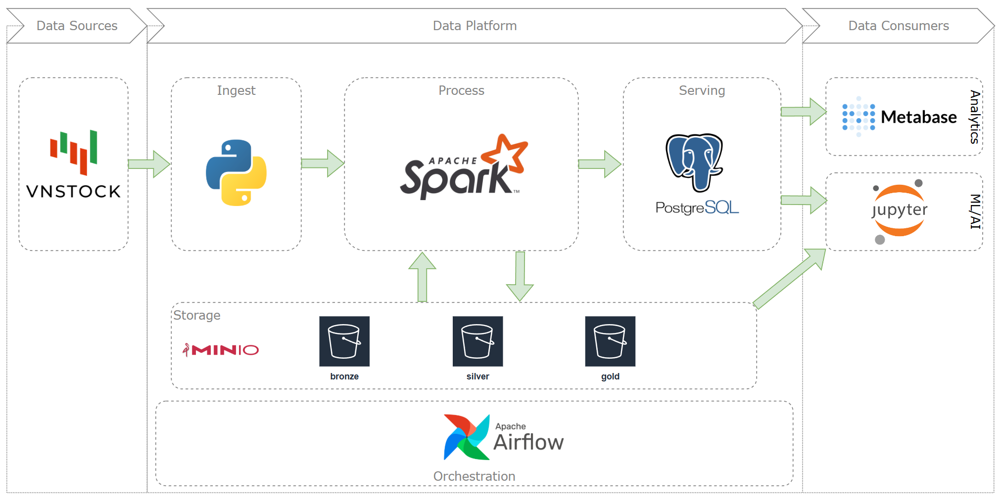
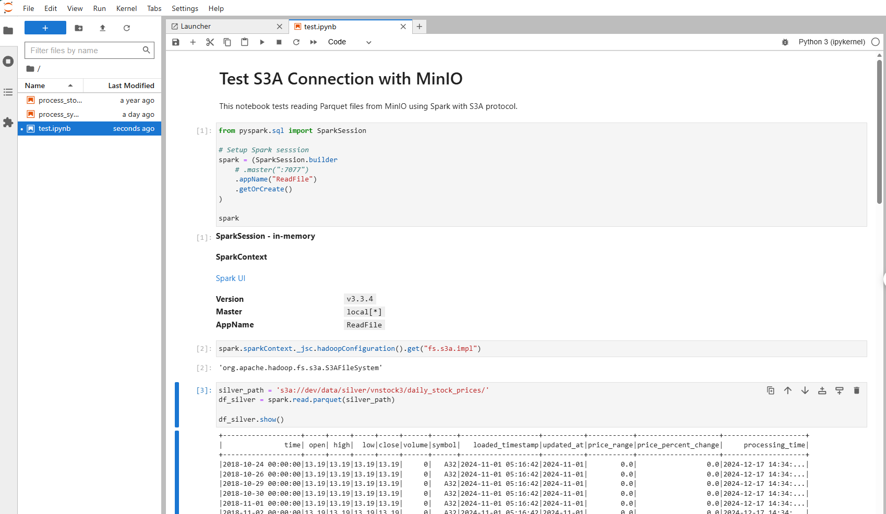
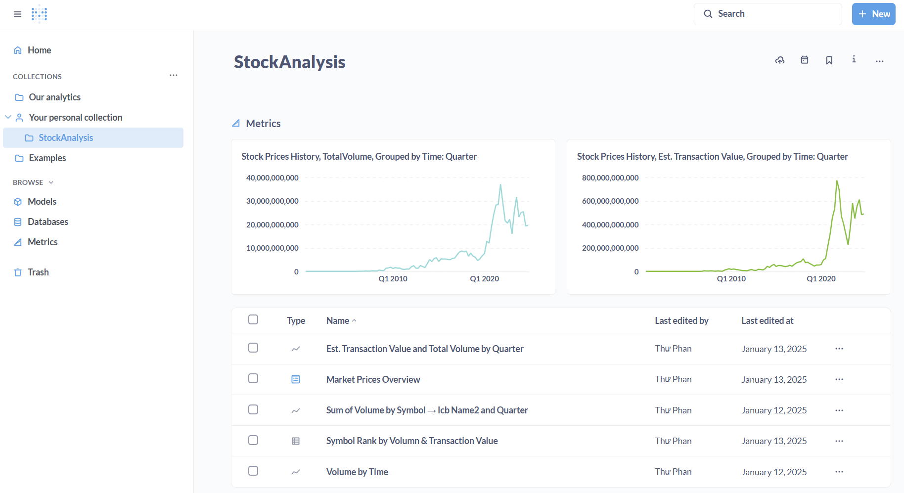

# Market Data Hub

A data engineering project for Vietnamese stock market data processing and analysis.

## Overview

This project implements a complete data engineering workflow: extracting market data from VNStock API, orchestrating batch ingestion with Airflow, storing raw/processed data in MinIO (S3-compatible storage), loading structured data to PostgreSQL, and enabling analysis through Jupyter notebooks and Metabase dashboards.


### High-Level Architecture

**Key Technologies**: Python • Apache Airflow • Apache Spark • MinIO/S3 • PostgreSQL • Metabase • Docker



### What's Implemented

- ✅ **Batch Data Ingestion**: Python scripts for extracting stock and company data from VNStock API
- ✅ **Pipeline Orchestration**: Airflow DAGs for scheduling and monitoring data workflows
- ✅ **Data Lake Storage**: MinIO (S3-compatible) for bronze/silver layer data storage
- ✅ **Data Processing**: PySpark transformations for cleaning and structuring market data
- ✅ **Data Warehouse**: PostgreSQL for structured analytical data storage
- ✅ **Data Visualization**: Metabase dashboards for business intelligence and reporting
- ✅ **Exploratory Analysis**: Jupyter notebooks for ad-hoc data exploration and validation

## Quick Start

To run this project locally:

```bash
# Clone and navigate to project
git clone https://github.com/plat102/pj-market-data.git
cd pj-market-data

# Build and start services
make build
make up
```

### Accessing Services

Once services are running, you can access:

| Service | URL | Port | Credentials |
|---------|-----|------|-------------|
| **Airflow Webserver** | http://localhost:8081 | 8081 | user: `airflow`, pass: `airflow` |
| **Jupyter Lab** | http://localhost:8888 | 8888 | Check logs for token: `docker-compose logs spark-notebook` |
| **MinIO Console** | http://localhost:9001 | 9001 | user: `minio`, pass: `minio123` |
| **Metabase** | http://localhost:3000 | 3000 | Setup on first access |
| **Spark Master UI** | http://localhost:8080 | 8080 | N/A |
| **Spark Application UI** | http://localhost:4040 | 4040 | N/A (Active when Spark job is running) |
| **PostgreSQL** | localhost:5433 | 5433 | user: `airflow`, pass: `airflow` |


#### Running the Pipelines

**Data Ingestion Pipeline:**


**Data Transformation Pipeline:**


#### Data Storage & Management

**MinIO Data Lake:**


#### Data Analysis & Visualization

**Jupyter Lab for Exploratory Analysis:**



**Metabase Dashboards for Business Intelligence:**



For detailed setup instructions, environment configuration, and development workflow, see [`docs/developer_guide.md`](docs/developer_guide.md).

## Project Structure

```
finance_hub/
├── airflow/           # Airflow DAGs and configuration
├── src/pipeline/      # ETL modules (extract, transform, load)
├── notebooks/         # Jupyter notebooks for analysis
├── spark/             # Spark job configurations
├── minio/             # Object storage data
├── postgresql/        # Database initialization scripts
└── docs/              # Detailed documentation
```

## Documentation

- 📖 **[Developer Guide](docs/developer_guide.md)** - Setup, configuration, and development workflow
- 🏗️ **[Architecture](docs/architecture.md)** - System design and component overview
- 🗺️ **[Roadmap](docs/roadmap.md)** - Project objectives and scope

## Important Resources

### Official Documentation
- **[Apache Airflow](https://airflow.apache.org/docs/)** - Workflow orchestration platform
- **[Apache Spark](https://spark.apache.org/docs/latest/)** - Unified analytics engine
- **[MinIO](https://min.io/docs/minio/linux/index.html)** - S3-compatible object storage
- **[PostgreSQL](https://www.postgresql.org/docs/)** - Relational database
- **[Metabase](https://www.metabase.com/docs/latest/)** - Business intelligence tool

### Data Source
- **[VNStock](https://github.com/thinh-vu/vnstock)** - Vietnamese stock market data API
- **[VNStock Documentation](https://docs.vnstock.site/)** - API reference and guides

### Architecture Patterns
- **[Medallion Architecture](https://www.databricks.com/glossary/medallion-architecture)** - Bronze, Silver, Gold layers
- **[Data Pipeline Design Patterns](https://www.startdataengineering.com/post/design-patterns/)** - ETL/ELT best practices

### Learning Resources
- **[Awesome Data Engineering](https://github.com/igorbarinov/awesome-data-engineering)** - Curated list of data engineering tools
 
## Key Learnings

- Designed and implemented an object-oriented ETL pipeline architecture
- Integrated Apache Spark and Airflow for scalable data processing
- Configured Docker-based multi-service orchestration for data engineering stack
- Applied medallion architecture pattern (bronze/silver layers) for data lake organization

## License & Contact

**Author**: Thu Phan  
**Repository**: [github.com/plat102/pj-market-data](https://github.com/plat102/pj-market-data)
