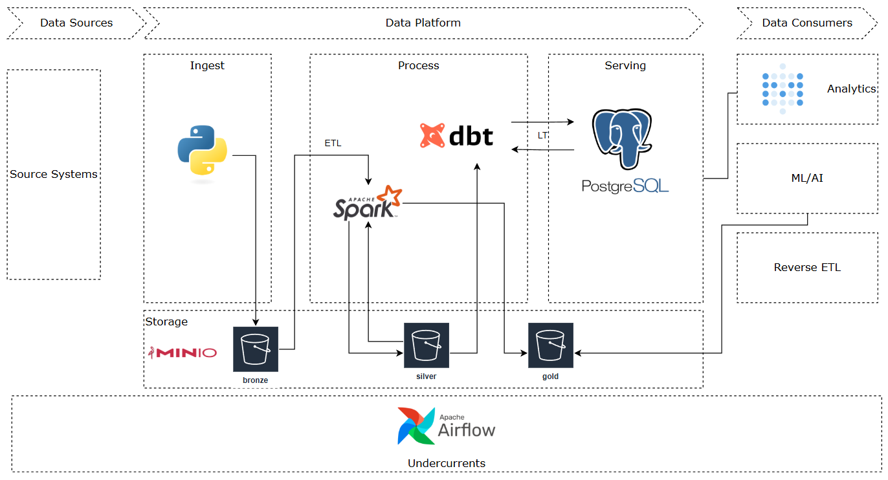
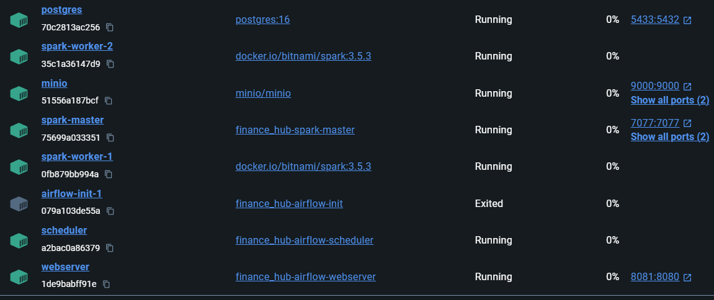
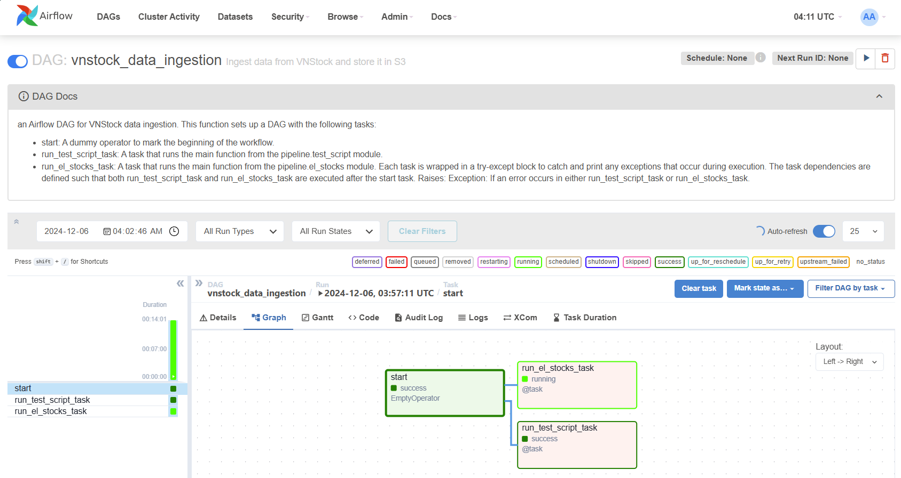
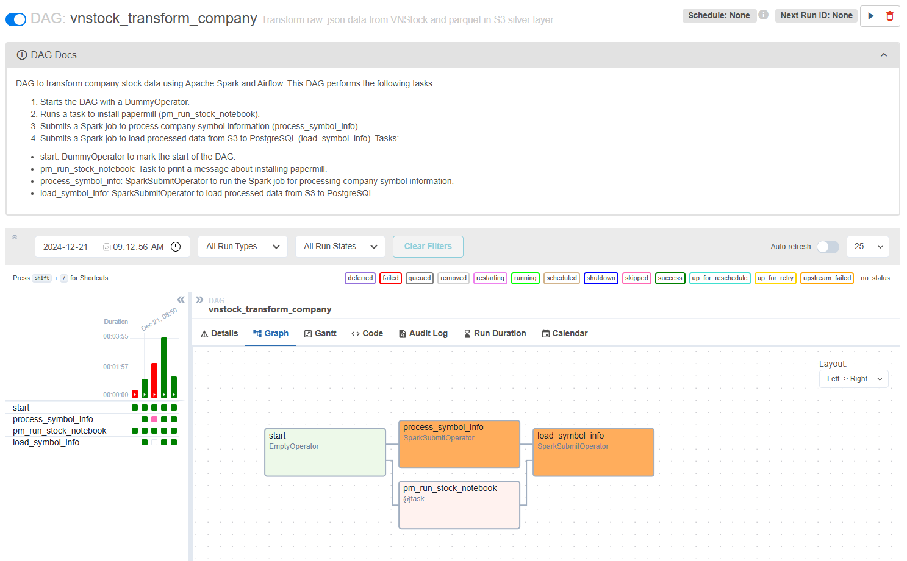
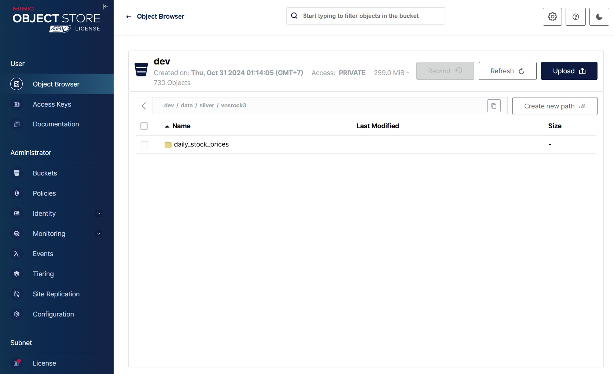

# Market Data Hub

A data project designed to collect, process, and analyze market data.

## References

* [Python Poetry in 8 Minutes](https://www.youtube.com/watch?v=Ji2XDxmXSOM&ab_channel=ArjanCodes)

Spark

* [Setting up Apache Airflow and Spark Clusters on Docker](https://www.youtube.com/watch?v=4IaE2eHTfR0&ab_channel=CodeWithYu)
* [Setting up a Spark standalone cluster on Docker in layman terms | by Marin Aglić | Medium](https://medium.com/@MarinAgli1/setting-up-a-spark-standalone-cluster-on-docker-in-layman-terms-8cbdc9fdd14b)

Airflow

* [GitHub - Rafavermar/SparkAirflow-PythonScala](https://github.com/Rafavermar/SparkAirflow-PythonScala)
* [Building the image — docker-stack Documentation](https://airflow.apache.org/docs/docker-stack/build.html#extending-the-image)

## Requirements

### Objectives

1. Unified Data Aggregation
2. Real-time and Batch Data Ingestion
3. Data Lake and Warehouse Storage
4. Pipeline Orchestration & Scheduling

Others:
Analytics & Insights Delivery
Monitoring & Alerting
Scalability & Modularity
Cost-Effective and Free Usage

### Deliverables

**Phase 1: Ingestion** **& Data Collection**

* [X] **Python scripts** to fetch data from APIs (e.g., stock market, news).
* [ ] **Web scraper** (optional) to collect additional data.

**Phase 2: Data Pipelines & Storage**

* [X] Batch pipeline to ingest historical data into the data lake/warehouse.
* [ ] Streaming pipeline using Kafka to handle real-time data.
* [X] Storage setup in **MinIO/S3** for raw and processed data.

**Phase 3: Orchestration & Scheduling**

* [ ] Airflow DAGs to orchestrate and automate the pipelines.
* [ ] Event-driven pipelines triggered by Kafka events.

**Phase 4: Analytics & Insights**

* [ ] SQL queries and Python scripts to extract insights.
* [X] Jupyter notebooks connection for analysis
* [ ] Metabase or Grafana dashboards for visualization.

**Phase 5: Monitoring & Alerts**

* [ ] Prometheus metrics and Grafana dashboards to monitor the system.
* [ ] Alerts configured for pipeline failures or API downtime.

#### Success criteria

* End-to-end pipeline integration: From data ingestion to transformation and analytics
* Scalable and modular architecture: Easy to add new data sources or extend functionality.
* Clean and documented code: Maintainable, well-commented scripts, and clear folder organization.
* Working dashboards or reports: Showcasing insights
* Monitoring and alerts in place: Real-time pipeline and infrastructure health checks

## Architecture

### Technology



### Folder structure

```
finance_hub/
│
├── airflow/        # Airflow DAGs & configs
├── dbt/            # dbt models & transformations
├── image/          # images for docs
├── kafka/          # Kafka topics, producers & consumers
├── minio/          # MinIO storage setup
├── monitoring/     # Prometheus & Grafana setup
├── notebooks/      # Jupyter notebooks for analysis
├── postgresql/     # PostgreSQL database scripts
├── secrets/        # Credentials & sensitive files
├── spark/          # Spark ETL & streaming jobs
├── src/            # Source code (ETL, API, utils)
├── terraform/      # Infrastructure as code (Terraform)
│
├── .env            # Environment variables
├── .gitignore      # Git ignore file
├── .pylintrc       # Linter config
├── docker-compose.yml  # Service orchestration
├── download_jars.sh    # Script for downloading dependencies
├── Makefile        # Automation tasks
├── poetry.lock     # Dependency lock file
├── pyproject.toml  # Python project metadata
├── README.md       # Project documentation
├── spark.env       # Spark environment variables
```

## Run the project

### Set up environment

```
# From the root of project folder
python -m venv .venv  # Create a virtual environment named venv
source .venv/bin/activate  # Activate it on Linux/macOS
.\.venv\Scripts\activate   # Activate it on Windows
```

#### Sample .env file

`.env`:

```
SRC_PATH=D:\CODE\de_projects\finance_hub\src

# PostgreSQL Configuration
POSTGRES_USER=airflow
POSTGRES_PASSWORD=airflow
POSTGRES_DB=airflow

# Airflow Paths
AIRFLOW_DAGS=./airflow/dags
AIRFLOW_LOGS=./airflow/logs
AIRFLOW_PLUGINS=./airflow/plugins
AIRFLOW_SECRETS=./airflow/secrets
AIRFLOW_PYTHONPATH=./src
AIRFLOW_DATA=./airflow/data

# Airflow User Configuration
AIRFLOW_UID=50000
AIRFLOW_GID=50000
AIRFLOW_WWW_USER=airflow
AIRFLOW_WWW_PASSWORD=airflow

# MinIO Credentials
MINIO_ROOT_USER=minio
MINIO_ROOT_PASSWORD=minio123
MINIO_ACCESS_KEY=
MINIO_SECRET_KEY=
MINIO_URL= http://localhost:9000

METADATA_KEY="/metadata/symbols_metadata.json"
BRONZE_PATH="/data/bronze"
SILVER_PATH="/data/silver"

# Network Configuration
NETWORK_NAME=spark_network

# Spark Worker Configuration
SPARK_IMAGE_VERSION=3.5.3
SPARK_WORKER_MEMORY=2G
SPARK_WORKER_CORES=1

```

spark.env

```
# MinIO Credentials
MINIO_ROOT_USER=minio
MINIO_ROOT_PASSWORD=minio123
MINIO_ACCESS_KEY=
MINIO_SECRET_KEY=
MINIO_URL= http://minio:9000

METADATA_KEY="/metadata/symbols_metadata.json"
BRONZE_PATH="/dev/data/bronze"
SILVER_PATH="/dev/data/silver"
```

Airflow.env

```
# MinIO Credentials
MINIO_ROOT_USER=minio
MINIO_ROOT_PASSWORD=minio123
MINIO_ACCESS_KEY=
MINIO_SECRET_KEY=
MINIO_URL= http://minio:9000

METADATA_KEY="/metadata/symbols_metadata.json"
BRONZE_PATH="/dev/data/bronze"
SILVER_PATH="/dev/data/silver"

```

#### `poettry` for Dependency Management

* [Python Poetry in 8 Minutes](https://www.youtube.com/watch?v=Ji2XDxmXSOM&ab_channel=ArjanCodes)

```
python -m pip install poetry
poetry init --name finance-data-project --author "Thu Phan" --python "^3.10"
```

Install packages

```
poetry add pandas@1.5.3  # Installs pandas 1.5.3
poetry add kafka-python@2.0.2
```

Update package

```
poetry update panda

# update all
poetry update
```

Generate requirements.txt if needed

```
poetry export -f requirements.txt --output requirements.txt --without-hashes
```

### Build and run

```
make build
make up
```



### Accessing services

| Service                    | URL                                         | Port |
| -------------------------- | ------------------------------------------- | ---- |
| Airflow Webserver          | [http://localhost:8080](http://localhost:8080) | 8080 |
| MinIO Console              | [http://localhost:9001](http://localhost:9001) | 9001 |
| Spark Master               | [http://localhost:8080](http://localhost:8080) | 8080 |
| Spark notebook application | [http://localhost:4040](http://localhost:4040) |      |
| PostgreSQL                 | N/A                                         | 5433 |

- Ensure that the services are running before attempting to access the URLs.
- Use the provided access and secret keys (in `docker-compose.yaml`) to log in.

#### Airflow

DAGs:

##### Run the ingestion pipeline(s)



##### Run the transform pipeline()s)



#### MinIO



#### Spark Notebooks & UI

[🚧 Update in Progress]

#### Metabase

[🚧 Update in Progress]

## Notes:

#### git convention

[Conventional Commits Cheatsheet (github.com)](https://gist.github.com/qoomon/5dfcdf8eec66a051ecd85625518cfd13)

| Type     | Description                                                                                                 |
| -------- | ----------------------------------------------------------------------------------------------------------- |
| feat     | A new feature                                                                                               |
| fix      | A bug fix                                                                                                   |
| docs     | Documentation only changes                                                                                  |
| style    | Changes that do not affect the meaning of the code (white-space, formatting, missing semi-colons, etc.)     |
| refactor | A code change that neither fixes a bug nor adds a feature                                                   |
| perf     | A code change that improves performance                                                                     |
| test     | Adding missing tests or correcting existing tests                                                           |
| build    | Changes that affect the build system or external dependencies (example scopes: gulp, broccoli, npm)         |
| ci       | Changes to our CI configuration files and scripts (example scopes: Travis, Circle, BrowserStack, SauceLabs) |
| chore    | Other changes that don't modify `src` or `test` files                                                   |
| revert   | Reverts a previous commit                                                                                   |

### Lessons Learned

* Implementing an OOP-style ETL pipeline
* Setting up and integrating Spark and Airflow
* Processing data efficiently with Spark
* Exploring stock analysis while designing data serving strategies

### Future Enhancements

* Accelerating stock data ingestion (BS4-based approach is a bit slow)
* Expanding data sources (e.g., housing, finance news) to build a unified view
* Implement real-time analytics with a streaming layer for timely insights
* Improving package management for Python projects (tried Poetry but still not familiar with it)

---

## Contact me
