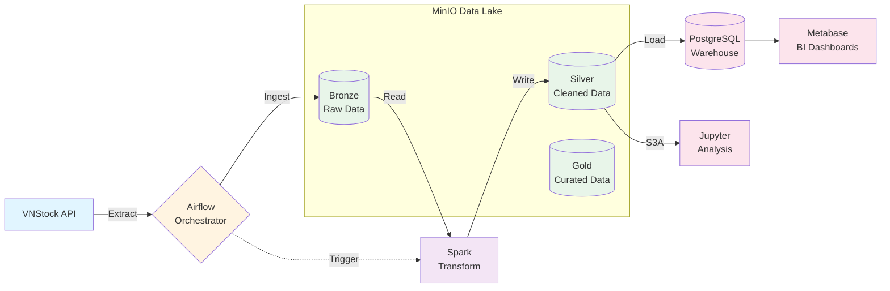

# Architecture Overview

This document describes the system architecture, component design, and data flow for the Market Data Hub project.

## System Architecture

### High-Level Design

```
┌─────────────┐     ┌──────────────┐     ┌───────────────────────────┐
│  VNStock    │────▶│   Airflow    │────▶│   MinIO (Data Lake)       │
│   API       │     │ (Orchestrate)│     │  Bronze → Silver → Gold   │
└─────────────┘     └──────┬───────┘     └─────────┬─────────────────┘
                           │                       │
                           │ triggers              │ reads
                           │                       │
                           ▼                       ▼
                    ┌──────────────┐        ┌─────────────┐
                    │    Spark     │────────│   Jupyter   │
                    │ (Transform)  │        │   Notebook  │
                    └──────┬───────┘        └─────────────┘
                           │
                           │ loads
                           ▼
                    ┌──────────────┐        ┌─────────────┐
                    │  PostgreSQL  │───────▶│  Metabase   │
                    │ (Warehouse)  │        │ (Analytics) │
                    └──────────────┘        └─────────────┘
```

### Component Overview

| Component | Purpose | Technology |
|-----------|---------|------------|
| **Data Source** | Vietnamese stock market data | VNStock API |
| **Orchestration** | Workflow scheduling and monitoring | Apache Airflow |
| **Data Lake** | Raw and processed data storage | MinIO (S3-compatible) |
| **Data Processing** | Transformation and cleaning | Apache Spark (PySpark) |
| **Data Warehouse** | Structured analytical data storage | PostgreSQL |
| **Visualization** | Business intelligence dashboards | Metabase |
| **Analysis** | Data exploration and validation | Jupyter Notebooks |

## Data Flow

### Data Pipeline Architecture



### End-to-End Pipeline Steps

```
1. Extract (VNStock API)
   └─▶ src/pipeline/extract/vnstock_lib.py
       │
2. Load to Data Lake (Bronze Layer)
   └─▶ src/pipeline/load/s3.py
       └─▶ MinIO: s3a://dev/data/bronze/vnstock3/
           │
3. Transform (Silver Layer)
   └─▶ src/pipeline/transform/vnstock.py
       └─▶ Spark processing (PySpark)
           └─▶ MinIO: s3a://dev/data/silver/vnstock3/
               │
4. Load to Data Warehouse
   └─▶ src/pipeline/load/postgres.py
       └─▶ PostgreSQL: analytics database
           │
5. Visualize & Analyze
   ├─▶ Metabase: Business dashboards
   └─▶ Jupyter: Ad-hoc analysis with Spark
```

### Medallion Architecture

The project follows the medallion architecture pattern:

- **Bronze Layer**: Raw, unprocessed data from sources
  - Format: JSON/Parquet
  - Location: `minio/bronze/`
  - No transformations applied

- **Silver Layer**: Cleaned and validated data
  - Format: Parquet
  - Location: `minio/silver/`
  - Schema validated, duplicates removed

- **Gold Layer**: (Planned) Aggregated, business-ready data
  - Format: Parquet
  - Location: `minio/gold/`
  - Optimized for analytics

## Code Architecture

### Module Organization

```
src/pipeline/
├── extract/              # Data extraction
│   ├── base.py          # Base extractor interface
│   └── vnstock_lib.py   # VNStock API extractor
│
├── transform/           # Data transformation
│   ├── base.py         # Base transformer interface
│   └── vnstock.py      # Stock data transformations
│
├── load/               # Data loading
│   ├── base.py        # Base loader interface
│   ├── s3.py          # MinIO/S3 loader
│   └── postgres.py    # PostgreSQL loader
│
└── commons/           # Shared utilities
    ├── connectors/    # Service connections
    │   ├── s3.py     # S3/MinIO connector
    │   ├── postgres.py # PostgreSQL connector
    │   └── vnstock_lib.py # VNStock connector
    ├── helpers.py     # Utility functions
    ├── constants.py   # Configuration constants
    └── custom_exceptions.py # Custom exceptions
```

### Design Patterns

**1. Base Class Pattern**
- All extractors, transformers, and loaders inherit from base classes
- Ensures consistent interface across components
- Simplifies testing and mocking

**2. Connector Pattern**
- Separate connection logic from business logic
- Reusable across different pipeline stages
- Easy to swap implementations (e.g., MinIO → AWS S3)

**3. Configuration Management**
- Environment variables for credentials
- Constants file for static configuration
- Separate env files for different services

## Airflow DAGs

### DAG Structure

```python
vnstock_ingest_stock
├── start (DummyOperator)
└── run_test_script_task (PythonOperator)
    └── run_el_stocks_task (PythonOperator)

vnstock_transform_stock
├── start (DummyOperator)
└── transform_stock_data (PythonOperator)
```

### DAG Design Principles

- **Idempotent**: Can be re-run safely without side effects
- **Atomic**: Each task is a single, well-defined operation
- **Modular**: Tasks call reusable pipeline modules
- **Monitored**: Built-in Airflow monitoring and alerting

## Storage Architecture

### MinIO Structure

```
minio/
└── dev/                    # Development bucket
    ├── metadata/           # Symbol metadata, configs
    │   └── symbols_metadata.json
    ├── data/
    │   ├── bronze/         # Raw ingested data
    │   │   ├── stocks/
    │   │   └── companies/
    │   └── silver/         # Processed data
    │       ├── stocks/
    │       └── companies/
```

### PostgreSQL Schema

```sql
-- Airflow metadata (managed by Airflow)
airflow
├── dag
├── dag_run
├── task_instance
└── ...

-- Metabase application database
metabase
├── metabase_database
├── metabase_table
├── report_card
└── ...

-- Analytics database (for data warehouse)
analytics
├── stock_prices      # Daily stock price data
├── company_info      # Company information
├── market_summary    # Aggregated market metrics
└── pipeline_logs     # ETL execution logs
```

## Deployment Architecture

### Docker Compose Services

```yaml
services:
  - airflow-webserver    # Airflow UI and API
  - airflow-scheduler    # DAG scheduler
  - airflow-init         # Airflow initialization
  - postgres             # Database (Airflow, Metabase, Analytics)
  - minio                # S3-compatible object storage
  - spark-master         # Spark cluster master
  - spark-worker         # Spark workers (scalable)
  - spark-notebook       # Jupyter notebook with Spark
  - metabase             # BI and visualization platform
```

### Network Configuration

- All services on shared Docker network: `spark_network`
- Service discovery via Docker DNS
- Port mappings for external access

## Design Decisions

### Why MinIO?

- S3-compatible API (easy to migrate to AWS)
- Runs locally for development
- No cloud costs for portfolio project
- Familiar object storage patterns

### Why Airflow?

- Industry-standard orchestration
- Rich UI for monitoring
- Extensive plugin ecosystem
- Python-native DAG definitions

### Why Spark?

- Scalable data processing
- Handles large datasets efficiently
- Integration with data lake storage
- Portfolio-relevant skill

### Why PostgreSQL?

- Reliable relational database for structured data
- Required by Airflow for metadata
- Supports Metabase application database
- Analytics data warehouse for processed data
- ACID compliance for data integrity
- Well-understood and production-proven

### Why Metabase?

- Open-source BI platform
- Easy dashboard creation without code
- SQL query interface for analysts
- Connects directly to PostgreSQL
- Shareable reports and visualizations
- Self-service analytics capability

## Scalability Considerations

### Current Scope

- Single-node Spark cluster for development
- Local MinIO storage (not distributed)
- PostgreSQL on single instance

### Production Extensions (Future)

- Multi-node Spark cluster
- AWS S3 or cloud object storage
- Kubernetes orchestration
- Auto-scaling workers
- Monitoring with Prometheus/Grafana

## Security Notes

### Current Implementation

- Credentials in environment variables
- Docker internal networks
- Local development only

### Production Requirements

- Secret management (e.g., AWS Secrets Manager)
- IAM roles and policies
- Network segmentation
- Encryption at rest and in transit
- Audit logging

---

For detailed project structure, see [developer_guide.md](developer_guide.md).  
For setup instructions, see [developer_guide.md](developer_guide.md).  
For project objectives and scope, see [roadmap.md](roadmap.md).
